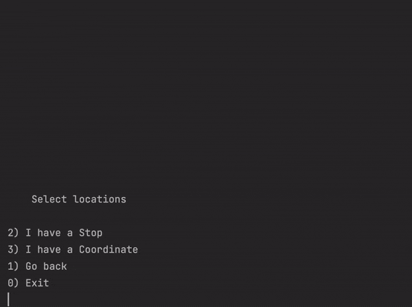

# Transport-Navigator

*CLI project. Manage a bus network and navigate trough it. Group project @ FEUP.*

This project was made in January of 2021 as part of the Algorithms and Data Structures course at FEUP. It was made using C++ and OOP and the idea was to implement graph algorithms (including path finding) that were discussed in class.

### Context

Given the bus lines from Oporto, construct a program that can navigate trough them. The program should include different options to calculate routes as well as diverse options and settings to make the program more versatile and user-friendly.

### Program

Using graphs and path finding algorithms (like *bfs* and *dijkstra*) we created a CLI to manage the application. Implemented features include:

 - Different path options (fewest stops, cheapest, fewest distance, ...)
 - The ability to block lines and stops
 - Change the time of the day so the lines are selected accordingly
 - Allow stop changes by foot and decide the maximum walking distance between them

To learn more about the project check out the [presentation](navigator_presentation.pdf).

### Program demo

## About the project
### **Made by:**
 - [André Barbosa](https://github.com/andrebarbosa02)
 - [Guilherme Almeida](https://github.com/theguilhermealmeida)
 - [José Luís Rodrigues](https://github.com/jlcrodrigues)

*January of 2021*
